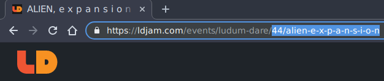

# @ludum-dare-badges

API used to dynamically generate SVG and PNG Ludum Dare results badges in real-time.

**[Live Demo](https://badges.vandoorn.ca)**

**Note:** This project is community made and not endorsed by the offical Ludum Dare creator(s).

# Packages

This monorepo is split up into the following packages:

-   **[@ludum-dare-badges/api](https://github.com/woofers/ludum-dare-badges/tree/master/packages/api)** - Serveless API used to generate SVG & PNG badges
-   **[@ludum-dare-badges/demo](https://github.com/woofers/ludum-dare-badges/tree/master/packages/demo)** - Demo site used to showcase how to build a API query for a badge
-   **[@ludum-dare-badges/react](https://github.com/woofers/ludum-dare-badges/tree/master/packages/react)** - React wrapper component which forms and calls the API based off passed props.

# Examples

**SVG Badge:**

**PNG Badge:**

# Usage

Simply form the API query using your game's Ludum Dare entry page path.

The path is in the form `:event/:game/badge.<type>` where:

-   `event` - Ludum Dare event number (eg. `44` for Ludum Dare 44)
-   `game` - Game title in the URL of the Ludum Dare entry page.
-   `type` - File type.  Can be either `svg` or `png`.  `svg` is recommenced if it is supported.

For example the SVG badge for [ALIEN, e x p a n s i o n .](https://ldjam.com/events/ludum-dare/44/alien-e-x-p-a-n-s-i-o-n)
the path would be `44/alien-e-x-p-a-n-s-i-o-n/badge.svg`

You can also think of it as adding `/badge.svg` to the existing Ludum Dare path:

## Hosted

This path can be appended to the domain of `badges.vandoorn.ca` to form the image URL:

    badges.vandoorn.ca/44/alien-e-x-p-a-n-s-i-o-n/badge.svg

Or more generalized:

    badges.vandoorn.ca/:id/:game/badge.<type>

`badges.vandoorn.ca` may also be used as the domain.

## Self Hosting

Self hosting can done easily though [Now](https://zeit.co/now)'s serverless platform.

Simply install the [Now CLI](https://github.com/zeit/now-cli) with:

**Yarn**

    yarn global add now

**npm**

    npm install -g now

and type `now deploy` in the root of the monorepo.

To form the API query follow the steps above with and replace the domain
with the domain of your self hosted instance:

    <example.com>/:id/:game/badge.<type>
